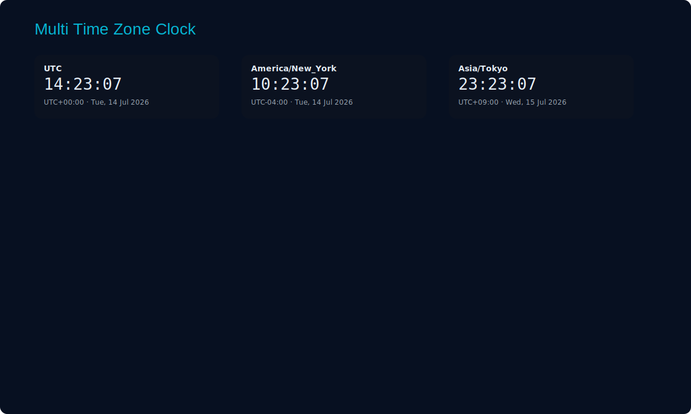

# BMS-points-list — Multi Time Zone Digital Clock

This repository contains a simple, single-file digital clock (index.html) that shows the current time and date for multiple IANA time zones. You can add or remove time zones, and it updates every second.

## Files added

- `index.html` — The multi time-zone clock (already committed).
- `README.md` — This README (you're looking at it).
- `screenshots/clock-1.svg` — Screenshot of the clock with several zones shown.
- `screenshots/clock-2.svg` — Screenshot showing the add-zone controls.

## Screenshots

## How to run

1. Clone the repo:

   git clone https://github.com/marshvac2811/BMS-points-list.git
   cd BMS-points-list

2. Open the clock in your browser:

   - Double-click `index.html`, or
   - Serve it locally:
     - Python 3: `python -m http.server 8000`
     - Then visit: `http://localhost:8000`

## Notes

- The clock uses the browser's Intl API for time zone handling (IANA names like `America/New_York`).
- The screenshots are SVG images included for convenience; they are mock screenshots representing the UI.

## Next steps (optional)

- Publish via GitHub Pages (I can help enable Pages and create the workflow or set the branch).
- Convert the UI into a React or Vue component.
- Persist selected time zones to localStorage.

## License

This repository is public domain / MIT — feel free to reuse and adapt.
